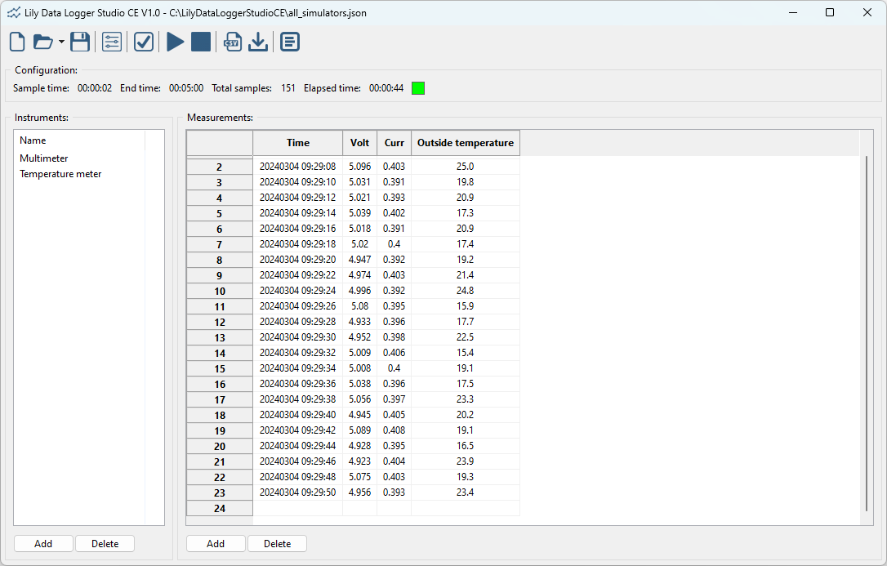

# Lily Data Logger Studio CE (Community Edition)

Universal data logger software aiming to work with any kind of electronics measurement devices
(multimeters, oscilloscopes, power supplies, etc.).

## Releases

Coming up V1.0.0:

## Features

* Logging data (measurements) in a table.
* Free and open source for personal and professional use.
* Build in drivers for the following instruments:
  * Arduino DAQ: reading analog voltages, reading and writing digital IO. A sketch for the Arduino is included.
  * Multimeter simulator giving random values for voltage and current, for testing measurements.
* Fixed end time or continuous measurement.
* Smallest sample interval: 1 second.
* Adding your own instrument drivers (see manual)
* Data from the table can be copied and pasted to a spreadsheet (Excel, LibreOffice, etc.).
* Export to CSV for using data in other applications (databases, scripting, etc.).
* OS compatibility:
  * Developed and tested primarily for Windows 10/11.
  * Tested on Ubuntu (22.04 LTS verion).
  * Not tested on MAC.

## About GPIB...

We get some questions if GPIB will be supported. GPIB is a standardized communication bus for instruments.
But the standardization is only on the GPIB part. The command and response structure are standardized.
What is not standardized is the GPIB PC controller. In the past PCs used ISA cards. 
Nowadays, you need to have a USB to GPIB controller. And in this controller lies the problem. 
Supporting the GPIB protocol is fairly easy. Supporting all available GPIB controllers on the market is a headache.
Every GPIB controller requires its own specific driver. And to test it, we need a sample of each controller available.
And those controllers are not cheap. So for now it is not very feasible to have GPIB supported. 
But... if someone is willing to donate a GPIB controller, we will be happy to add support for it.

## Adding your own instruments

You can add your own instruments. A manual for that will be available on the first release.

## Development

Requirements for running the software:

* Python 3.10 (Ubuntu 22.04 LTS has Python 3.10)
* Upgrade pip: python -m pip install --upgrade pip
* pip install -r requirements.txt

In `tests` is are several scripts for running the unit tests.
Test reports are written to `unit_test/test_reports`.

2023 - LilyTronics (https://lilytronics.nl)
